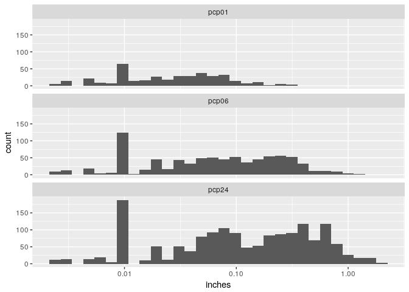

-   [Introduction](#introduction)
-   [Univariate Plots Section](#univariate-plots-section)
-   [Univariate Analysis](#univariate-analysis)
-   [Bivariate Plots Section](#bivariate-plots-section)
-   [Bivariate Analysis](#bivariate-analysis)
-   [Multivariate Plots Section](#multivariate-plots-section)
-   [Multivariate Analysis](#multivariate-analysis)
-   [Final Plots and Summary](#final-plots-and-summary)
-   [Reflection](#reflection)
-   [Resources](#resources)

Introduction
============

In the current project I'm exploring the factors that affect Uber cars demand in NYC.
For the exploration I have prepared a dataset by merging data that intuitively seem as possible factors to the analysis. These are:

-   Uber Pickups in New York City, from 01/01/2015 to 30/06/2015. (by [kaggle.com](https://www.kaggle.com/fivethirtyeight/uber-pickups-in-new-york-city))
-   Weather data from [National Centers for Environmental Information](https://www.ncdc.noaa.gov/).
-   LocationID to Borough mapping. (by [FiveThirtyEight](https://github.com/fivethirtyeight/uber-tlc-foil-response/blob/master/uber-trip-data/taxi-zone-lookup.csv))
-   NYC public holidays.

The wrangling is described in detail in [Wrangling UBER NYC data]()

The main dataset contained over 10 million observations of 4 variables which aggregated per hour and borough, and then joined with the rest of the datasets producing 29,101 observations across 13 variables. These are:

-   pickup\_dt: Time period of the observations.
-   borough: NYC's borough.
-   pickups: Number of pickups for the period.
-   spd: Wind speed in miles/hour.
-   vsb: Visibility in Miles to nearest tenth.
-   temp: temperature in Fahrenheit.
-   dewp: Dew point in Fahrenheit.
-   slp: Sea level pressure.
-   pcp01: 1-hour liquid precipitation.
-   pcp06: 6-hour liquid precipitation.
-   pcp24: 24-hour liquid precipitation.
-   sd: Snow depth in inches.
-   hday: Being a holiday (Y) or not (N).

<!-- -->

    ## 'data.frame':    29101 obs. of  13 variables:
    ##  $ pickup_dt: POSIXct, format: "2015-01-01 01:00:00" "2015-01-01 01:00:00" ...
    ##  $ borough  : Factor w/ 7 levels "Bronx","Brooklyn",..: 1 2 3 4 5 6 NA 1 2 3 ...
    ##  $ pickups  : int  152 1519 0 5258 405 6 4 120 1229 0 ...
    ##  $ spd      : num  5 5 5 5 5 5 5 3 3 3 ...
    ##  $ vsb      : num  10 10 10 10 10 10 10 10 10 10 ...
    ##  $ temp     : num  30 30 30 30 30 30 30 30 30 30 ...
    ##  $ dewp     : num  7 7 7 7 7 7 7 6 6 6 ...
    ##  $ slp      : num  1024 1024 1024 1024 1024 ...
    ##  $ pcp01    : num  0 0 0 0 0 0 0 0 0 0 ...
    ##  $ pcp06    : num  0 0 0 0 0 0 0 0 0 0 ...
    ##  $ pcp24    : num  0 0 0 0 0 0 0 0 0 0 ...
    ##  $ sd       : num  0 0 0 0 0 0 0 0 0 0 ...
    ##  $ hday     : Factor w/ 2 levels "Y","N": 1 1 1 1 1 1 1 1 1 1 ...

Univariate Plots Section
========================

Pickups
-------

The histogram is heavily skewed. I will use a square root scale on both axis to observe the left side more clearly.

-1.png)

This is a quite strange distribution. It looks like a union of normal distributions. I am suspecting that the different boroughs have very discrete distributions.
Although I am still in the univariate exploration phase I need to see the above histogram on borough level.

-1.png)

We can see that the majority of 0 pickups is created solely by EWR, Staten Island and from pickup data that we are missing the borough.
The rest 4 areas seem to have lightly skewed distribution on a squared root scale. I will split the boroughs.

-1.png)

The distributions of Staten Island and NA are so identical that make me wonder if they are duplicated data.

Some additional observations:

-   There is a clear difference in ridership between the different boroughs. Manhattan has by far the biggest demand, followed by Brooklyn, Queens and Bronx.
-   EWR and Staten Island have very few pickups. I'm not familiar with the area but from a practical perspective, the demand is so small that probably it can be covered by the drop-offs of the inbound trips from other areas.
-   Although all 4 major boroughs' pickups follow normal distributions in a square root scale (with Queens' slightly skewed), Manhattan appear to have a gap around 1,500. I assume there must be a pattern in the demand where it rises rapidly from values around 1,000 to nearly 2,500.

Weather
-------

The area's weather may affect the ridership.

Since all boroughs are neighboring, I used weather information from the same weather station ([LaGuardia Airport](https://en.wikipedia.org/wiki/LaGuardia_Airport)).
In a more optimized version we may use more localized weather stations but the area is relatively narrow for significant weather differences.
Additionally, using information from different stations may enter noise by various factors (like missing values or small calibration differences).

-1.png)

### Wind Speed

The histogram is positively skewed with a Mode of 5 miles/hour, means that most of the time there was a light breeze.
The speed tops at 21 miles/hour which is not even a strong breeze, though I don't expect significant impact to the ridership.

### Visibility

    ##    Min. 1st Qu.  Median    Mean 3rd Qu.    Max. 
    ##    0.00    9.10   10.00    8.82   10.00   10.00

    ## # A tibble: 1 × 1
    ##       n
    ##   <int>
    ## 1  1120

There was a completely clear atmosphere on most of the days except 1120 hours. This variable may affect our model.
We can also notice some "spikes" denoting (probably) rounding to integer values.

### Temperature

The period of observation is not ideal for examining how temperature affects ridership because the data do not include July which is the hottest month in NYC.

    ##    Min. 1st Qu.  Median    Mean 3rd Qu.    Max. 
    ##    2.00   31.50   45.00   47.49   64.00   89.00

The temperature varies from 2 to 89 degrees.
The distribution of the temperature is bi-modal with one peak around 35 degrees and the other near 60.
The gap between the modes may be caused by a rapid rising of temperature during spring, we can investigate it on the bivariate plots section.

### Dew Point

> Dew point is the temperature at which airborne water vapor will condense to form liquid dew. A higher dew point means there will be more moisture in the air.

Thus, dew point is an indication of the humidity.

Since dew point is correlated with temperature (by definition) their distributions appears similar.

### Sea Level Pressure

> Air pressure affects the weather by influencing the movement of air around the planet; **areas of low pressure generally develop clouds and precipitation, while areas of high pressure tend to bring clear, sunny weather conditions**.

Air pressure affects the weather in a later time, thus there might be a delayed effect in the ridership.

Sea level pressure has a normal distribution with mode at 1020 mBars.

### Precipitation

The amount of rain is very possible to affect the demand.
We have 3 measurements of precipitation, one for the last hour, one for the last 6 hours and one for the last 24 hours.

-1.png)

We can see how the histogram is transformed by the built up of the values because of the summation, which is more obvious if we use a log10 scale for the X axis.

### Snow Depth

Snow depth may also affect ridership.

    ## # A tibble: 1 × 1
    ##       n
    ##   <int>
    ## 1  1341

Most of the time there is not snow at all. There are 1341 observations (hours) of snow.

------------------------------------------------------------------------

Univariate Analysis
===================

### What is the structure of the dataset?

There are 29,101 hourly aggreagated observations in the dataset with 13 variables.

-   One of them is a datetime denoting the time of the measurement.
-   Two unordered factor variables for the borough of the pickup and whether it was a public holiday or not?
-   Ten continuous variables for the number of pickups and the weather conditions.

During the analysis I had to create a transformed copy of the dataset by splitting the 'borough' category to different column, to plot the weather variables.

### What is/are the main feature(s) of interest in your dataset?

The main feature of interest is the number of pickups. Both from environmental and business perspective, having cars roaming in an area while the demand is on another or filling the streets with cars during a low demand period while lacking during peak hours is inefficient.

### What other features in the dataset do you think will help support your investigation into your feature(s) of interest?

A critical factor for sure is the borough. The differences between borough are so big that maybe I should create a model per borough rather than use the borough as a factor.

    ## # A tibble: 7 × 2
    ##         borough `Total Pickups`
    ##          <fctr>           <int>
    ## 1     Manhattan        10367841
    ## 2      Brooklyn         2321035
    ## 3        Queens         1343528
    ## 4         Bronx          220047
    ## 5 Staten Island            6957
    ## 6            NA            6260
    ## 7           EWR             105

Also, even though so far I have not performed any bivariate analysis, my intuition says that strong factors will be the time of the day, the holidays and weekends, and the precipitation.

### Did you create any new variables from existing variables in the dataset?

I created a new variable for the pickups of each borough, plus the total pickups per hour. (8 in total)

### Of the features you investigated, were there any unusual distributions? Did you perform any operations on the data to tidy, adjust, or change the form of the data? If so, why did you do this?

Most of the variables have normal distributions with or without scaling the X axis.
There are a couple of bi-modal distribution denoting a probable rapid changes in their value on a time scale.
Finally, there are some variables representing weather variables with default/expected values at the edge of the scale (like precipitation =0 or visibility = 10) creating geometric distributions.

As mentioned above, I had to create a wide version of the dataset.

------------------------------------------------------------------------

Bivariate Plots Section
=======================

The first question we can use bivariate plots to answer is if I should create one model for the whole ridership and keep the borough as a variable, or I should break the dataset in boroughs.

### Time variables matrix

From the above pairs we can see that:

-   The datetime has a different impact on each borough. There is a strong correlation between Bronx, Queens and Brooklyn with the datetime, much more stronger from the general ridership. On the other hand this variable has practically no effect on EWR and a small effect on Manhattan. This indicates a significant rise of the demand to some areas and a constant demand to others.
-   The time of the day has a strong effect on most of the areas but have a medium effect on Staten Island and no effect on EWR.
-   The day of the week affect slightly some boroughs but not Queens and EWR.
-   On working days we have a higher demand on Bronx and Brooklyn.

In general, ridership in all boroughs except Staten Island and EWR are time dependent.

### Weather variables matrix

On the weather part,

-   The most critical factor is temperature but again it does not have the same strength across all boroughs.
-   Strangely, wind speed seems to affect only Bronx.

We can conclude that there are strong indications that a single model cannot have a good fit across all boroughs.

### Pickups VS datetime

Plotting the pickups VS datetime we can see that there is a clear pattern. There are 26 peaks, as many as the number of weeks in the investigated period. Also, there is a general rising of the number of pickups over time which is aligned with the findings of the pair plots.

### Distribution of pickups per day

There is a pattern also during the week. The demand starts low on Monday and then rises until Saturday when it peaks. On Sunday the demand falls to Wednesday's levels and then we go back to Monday.

### Pickups VS time of the day

Finally, there is a clear pattern of the ridership on a day level. The traffic starts low at 5 o'clock in the morning, starts rising until 9-10 o'clock in the morning when it hits a plateau. At around 2 o'clock in the afternoon it starts rising again until 8 o'clock in the evening when it hits the daily maximum. Even without the regression line the pattern is clear.

We can see a kind of split at around 7:00 until 10:00 and also the spread is getting higher during evening and night. The pickups on the plot are the sum of all boroughs so the location cannot explain it. Since 7:00-10:00 is the time period when most of the people commute to their offices, i assume it depicts different ridership patterns between working and non-working days. I will explore it further in the multivariate plots section.

### Impact of time of the day to ridership

    ## 
    ## Call:
    ## lm(formula = pickups ~ poly(hour, 7), data = uber.spread)
    ## 
    ## Residuals:
    ##     Min      1Q  Median      3Q     Max 
    ## -4856.0  -660.3   -89.3   651.2  6009.1 
    ## 
    ## Coefficients:
    ##                 Estimate Std. Error t value Pr(>|t|)    
    ## (Intercept)      3284.33      17.27 190.188   <2e-16 ***
    ## poly(hour, 7)1  76657.05    1138.04  67.359   <2e-16 ***
    ## poly(hour, 7)2  26013.41    1138.04  22.858   <2e-16 ***
    ## poly(hour, 7)3 -32137.87    1138.04 -28.240   <2e-16 ***
    ## poly(hour, 7)4  11276.08    1138.04   9.908   <2e-16 ***
    ## poly(hour, 7)5 -26670.94    1138.04 -23.436   <2e-16 ***
    ## poly(hour, 7)6    557.23    1138.04   0.490    0.624    
    ## poly(hour, 7)7  18877.73    1138.04  16.588   <2e-16 ***
    ## ---
    ## Signif. codes:  0 '***' 0.001 '**' 0.01 '*' 0.05 '.' 0.1 ' ' 1
    ## 
    ## Residual standard error: 1138 on 4335 degrees of freedom
    ## Multiple R-squared:   0.61,  Adjusted R-squared:  0.6094 
    ## F-statistic: 968.6 on 7 and 4335 DF,  p-value: < 2.2e-16

So far, hour of the day seems the strongest criterion for forecasting the ridership. A 7 degree polyonim of just the hour of the day can explain almost 61% of the variation.

### Working days VS non-working days

 

    ## [1] 1.357069

In general, there is a slight effect of working vs non-working days in ridership.
This is not the case for Brooklyn where in non-working days there is a 35.71% higher demand than on working days.

### Pickups VS temperature

The temperature seems to affect the ridership slightly until 75 degrees but it's effect is relatively strong after 75 degrees.
I will create a new variable named "over\_75F"

Now the correlation is more obvious.

### Temperature VS datetime

If we plot the temperature over time we can also explain the bi-modal distribution of the temperature. You can notice that there is a zone on 45-50 degrees which is higher than the temperatures of January - March and lower than these of period May - July, creating the gap in the distribution.

### Dew point VS temperature

Dew point is correlated with the temperature so probably I will use just one of them in my model.

### Pickups VS wind speed

There is a slight negative correlation between wind speed and ridership but I don't think it is strong enough to affect the ridership.

### Pickups VS visibility

### Pickups VS sea level pressure

### Pickups VS precipitation

-1.png)

Precipitation do not seem to have an effect on ridership. I will investigate it again in the multivariate plot section.

### Pickups VS snow depth

Finally, snow depth does not seem also to affect ridership.

------------------------------------------------------------------------

Bivariate Analysis
==================

### Talk about some of the relationships you observed in this part of the investigation. How did the feature(s) of interest vary with other features in the dataset?

It seems that time variables have a much stronger effect than weather variables on ridership.

We noticed a very strong effect of time of the day with the demand, being able to explain 61% of the variance by itself.
There is also a pattern on week level with the demand starting low on Monday and rising until it tops on Saturday then starts again to decrease. On a more macroscopic level, there is a rise on the demand on the evaluated period starting on the beginning of the year at around 2,000 pickups per hour and reaching 3,500 pickups by the end of June.

Considering the weather, the analysis does not provide any strong indication that any weather variable affect the ridership. The only exception might be the temperature on its highest values.

### Did you observe any interesting relationships between the other features (not the main feature(s) of interest)?

There are several relationships between the other features but since they are chronological and meteorological data there is nothing to surprise us.

### What was the strongest relationship you found?

The strongest relationship was between the time of the day and the ridership.
A 7 degree polynomial of the time can explain 61% of the variability of the demand.

------------------------------------------------------------------------

Multivariate Plots Section
==========================

In this section I will finalize the findings that came up on the previous sections.

### Borough and time of the day

-1.png)

It is clear that the time of the day and the borough are two of the most significant variables in predicting the ridership. Especially on the second plot where a logarithmic scale has been applied to Y axis, it is obvious that the 4 major boroughs follow the exact same pattern. The same applies to Staten Island but the values are much more disperse and I expect a higher degree of errors if we apply the same model. Finally EWR seems to have a random demand with the majority of the values being zero with a few 1s and 2s. It seems not feasible, and probably there is no need, to model the demand of this area.

### Day and time of the day

In the above heat map we can see the ridership through the week.
We can see the same pattern through the week with the demand rising from Monday onward, especially in the afternoon/evening hours and peaking on Saturday.
We can also notice a transposition of the demand during Saturday and Sunday for 3-4 hours comparing to working days.

### Working VS non-working days

 -1.png)

Non-working days change the ridership pattern through the day but they do not have a significant effect on the day's total demand.

### Temperature and rain

-1.png) -1.png)

Against our intuition, neither temperature nor rain play any significant role on the ridership. Even that we noticed a positive correlation between demand and temperature on higher temperatures, most probably it is because these temperatures are taking place during high demand hours (after 15:00).

### Predicting the demand

Exploratory Analysis has led us to the major factors that affect ridership. Typically we could conclude to a linear model that can predict ridership but probably a linear model is not the best for a dataset like this.
Although this is a typical time series with heavy autocorrelation and an autoregressive model would have much better fit, we can introduce some lag variables to take advantage of the seasonality.
The following actions will take place before the creation of the model:

-   Introduction of lag variables for the number of pickups for a week, a day, 3 hours, 2 hours and an hour.
-   Use a subset of the dataset, keeping only the 4 major boroughs that follow the same pattern.
-   Cut off the last week from the 'training' dataset to use it for validation of the model.

<!-- -->

    ## 
    ## Calls:
    ## m1: lm(formula = pickups ~ pickup_dt + hour + wday + workday + borough, 
    ##     data = uber.major[169:16700, ])
    ## m2: lm(formula = pickups ~ pickup_dt + hour + wday + workday + borough + 
    ##     `1w`, data = uber.major[169:16700, ])
    ## m3: lm(formula = pickups ~ pickup_dt + hour + wday + workday + borough + 
    ##     `1w` + `1d`, data = uber.major[169:16700, ])
    ## m4: lm(formula = pickups ~ pickup_dt + hour + wday + workday + borough + 
    ##     `1w` + `1d` + `3h`, data = uber.major[169:16700, ])
    ## m5: lm(formula = pickups ~ pickup_dt + hour + wday + workday + borough + 
    ##     `1w` + `1d` + `3h` + `2h`, data = uber.major[169:16700, ])
    ## m6: lm(formula = pickups ~ pickup_dt + hour + wday + workday + borough + 
    ##     `1w` + `1d` + `3h` + `2h` + `1h`, data = uber.major[169:16700, 
    ##     ])
    ## 
    ## ============================================================================================================================
    ##                                   m1              m2              m3              m4              m5              m6        
    ## ----------------------------------------------------------------------------------------------------------------------------
    ##   (Intercept)               -29229.742***   -33640.747***   -37069.154***   -35066.102***   -38152.276***   -35994.810***   
    ##                              (1696.827)      (1688.778)      (1705.475)      (1716.267)      (1707.836)      (1719.654)     
    ##   pickup_dt                      0.000***        0.000***        0.000***        0.000***        0.000***        0.000***   
    ##                                 (0.000)         (0.000)         (0.000)         (0.000)         (0.000)         (0.000)     
    ##   hour                          42.110***       41.967***       40.277***       38.053***       42.421***       39.441***   
    ##                                 (0.737)         (0.728)         (0.738)         (0.777)         (0.806)         (0.867)     
    ##   wday: .L                     201.821***      185.359***      193.479***      182.159***      203.941***      189.948***   
    ##                                (13.488)        (13.340)        (13.300)        (13.329)        (13.252)        (13.306)     
    ##   wday: .Q                      71.222*        108.295**       128.508***      121.417***      131.630***      125.690***   
    ##                                (35.870)        (35.460)        (35.346)        (35.272)        (34.929)        (34.848)     
    ##   wday: .C                     -85.153***      -88.017***     -102.192***      -95.918***     -106.438***     -100.506***   
    ##                                (13.515)        (13.344)        (13.338)        (13.326)        (13.207)        (13.190)     
    ##   wday: ^4                      24.974           6.785           5.827           4.366           7.586           6.113      
    ##                                (19.316)        (19.091)        (19.008)        (18.964)        (18.779)        (18.732)     
    ##   wday: ^5                     -22.537          -4.358          -3.425          -2.379          -5.216          -4.036      
    ##                                (13.723)        (13.577)        (13.518)        (13.487)        (13.355)        (13.322)     
    ##   wday: ^6                      19.248          12.805          10.026           9.254          11.051           9.788      
    ##                                (13.636)        (13.467)        (13.410)        (13.379)        (13.248)        (13.215)     
    ##   workday: Y/N                 -14.977         -18.091         -24.292         -22.926         -24.968         -24.039      
    ##                                (31.384)        (30.986)        (30.857)        (30.784)        (30.482)        (30.405)     
    ##   borough: Brooklyn/Bronx      479.082***      549.075***      605.643***      482.127***      175.420***      162.988***   
    ##                                (14.435)        (14.647)        (15.324)        (20.646)        (26.501)        (26.469)     
    ##   borough: Manhattan/Bronx    2329.305***     2668.416***     2943.046***     2948.739***     2629.011***     2596.863***   
    ##                                (14.435)        (21.712)        (31.445)        (31.377)        (35.698)        (35.779)     
    ##   borough: Queens/Bronx        256.739***      294.113***      324.412***      354.934***      111.894***      -40.848      
    ##                                (14.435)        (14.366)        (14.524)        (14.890)        (19.898)        (25.892)     
    ##   `1w`                                          -0.147***       -0.174***       -0.171***       -0.171***       -0.168***   
    ##                                                 (0.007)         (0.007)         (0.007)         (0.007)         (0.007)     
    ##   `1d`                                                          -0.091***       -0.090***       -0.086***       -0.087***   
    ##                                                                 (0.008)         (0.008)         (0.007)         (0.007)     
    ##   `3h`                                                                           0.066***        0.080***        0.089***   
    ##                                                                                 (0.007)         (0.007)         (0.007)     
    ##   `2h`                                                                                          -0.134***       -0.141***   
    ##                                                                                                 (0.007)         (0.007)     
    ##   `1h`                                                                                                           0.070***   
    ##                                                                                                                 (0.008)     
    ## ----------------------------------------------------------------------------------------------------------------------------
    ##   R-squared                          0.687           0.695           0.697           0.699           0.705           0.706  
    ##   adj. R-squared                     0.687           0.695           0.697           0.699           0.705           0.706  
    ##   sigma                            656.196         647.864         645.066         643.543         637.213         635.611  
    ##   F                               3020.176        2892.985        2720.036        2556.007        2464.777        2336.467  
    ##   p                                  0.000           0.000           0.000           0.000           0.000           0.000  
    ##   Log-likelihood               -130685.532     -130473.792     -130401.719     -130362.159     -130198.236     -130156.105  
    ##   Deviance                  7112963312.026  6933073150.515  6872885103.698  6840071171.648  6705761916.738  6671670314.004  
    ##   AIC                           261399.063      260977.583      260835.438      260758.318      260432.472      260350.210  
    ##   BIC                           261507.046      261093.279      260958.847      260889.440      260571.307      260496.758  
    ##   N                              16532           16532           16532           16532           16532           16532      
    ## ============================================================================================================================

Even the full model, cannot explain a good amount of the variance. This probably because as I noted in the previous sections there are significant differences between the boroughs.
Now I will apply the same procedure to a single borough (Manhattan).

    ## 
    ## Calls:
    ## m1: lm(formula = pickups ~ pickup_dt + hour + wday + workday, data = manhattan.train)
    ## m2: lm(formula = pickups ~ hour + wday + workday + `1w`, data = manhattan.train)
    ## m3: lm(formula = pickups ~ hour + wday + workday + `1w` + `1d`, data = manhattan.train)
    ## m4: lm(formula = pickups ~ hour + wday + workday + `1w` + `1d` + 
    ##     `3h`, data = manhattan.train)
    ## m5: lm(formula = pickups ~ hour + wday + workday + `1w` + `1d` + 
    ##     `3h` + `2h`, data = manhattan.train)
    ## m6: lm(formula = pickups ~ hour + wday + workday + `1w` + `1d` + 
    ##     `3h` + `2h` + `1h`, data = manhattan.train)
    ## 
    ## ================================================================================================================
    ##                         m1              m2              m3              m4             m5             m6        
    ## ----------------------------------------------------------------------------------------------------------------
    ##   (Intercept)     -53199.078***      26.842        -116.474**      -306.583***     -70.235         -5.078       
    ##                    (5511.418)       (46.624)        (43.275)        (41.989)       (36.982)       (24.234)      
    ##   pickup_dt            0.000***                                                                                 
    ##                       (0.000)                                                                                   
    ##   hour               136.528***      32.514***       14.481***       17.576***      19.808***      17.599***    
    ##                       (2.321)        (1.929)         (1.900)         (1.807)        (1.568)        (1.027)      
    ##   wday: .L           670.205***     149.388***      164.490***      130.572***     163.136***     129.234***    
    ##                      (42.545)       (27.167)        (25.028)        (23.780)       (20.638)       (13.523)      
    ##   wday: .Q            40.669        262.732***      148.807*        104.780         77.164         16.094       
    ##                     (111.581)       (69.333)        (64.000)        (60.708)       (52.640)       (34.482)      
    ##   wday: .C          -265.806***     -68.399**        -6.934          31.034        -12.348        -20.982       
    ##                      (42.506)       (26.505)        (24.520)        (23.314)       (20.249)       (13.261)      
    ##   wday: ^4            80.730        111.787**       132.764***      113.930***      91.373**       30.424       
    ##                      (60.245)       (37.423)        (34.477)        (32.696)       (28.355)       (18.587)      
    ##   wday: ^5           -77.174         -7.599         -22.253          -9.548        -14.603        -17.505       
    ##                      (43.034)       (26.755)        (24.648)        (23.374)       (20.267)       (13.272)      
    ##   wday: ^6            78.810         35.404          77.096**        77.361***      61.838**       26.099*      
    ##                      (42.885)       (26.654)        (24.599)        (23.320)       (20.223)       (13.252)      
    ##   workday: Y/N        50.330        252.091***      301.186***      284.244***     199.324***      87.351**     
    ##                      (97.459)       (60.553)        (55.802)        (52.907)       (45.931)       (30.117)      
    ##   `1w`                                0.778***        0.616***        0.552***       0.388***       0.152***    
    ##                                      (0.010)         (0.011)         (0.011)        (0.010)        (0.007)      
    ##   `1d`                                                0.292***        0.274***       0.193***       0.082***    
    ##                                                      (0.011)         (0.010)        (0.009)        (0.006)      
    ##   `3h`                                                                0.149***      -0.413***       0.102***    
    ##                                                                      (0.007)        (0.017)        (0.013)      
    ##   `2h`                                                                               0.718***      -0.662***    
    ##                                                                                     (0.020)        (0.023)      
    ##   `1h`                                                                                              1.222***    
    ##                                                                                                    (0.017)      
    ## ----------------------------------------------------------------------------------------------------------------
    ##   R-squared                0.491           0.803           0.833           0.850          0.887          0.952  
    ##   adj. R-squared           0.490           0.803           0.833           0.850          0.887          0.952  
    ##   sigma                 1016.591         631.703         581.823         551.570        478.223        313.166  
    ##   F                      428.564        1815.945        1998.160        2062.276       2624.806       6059.260  
    ##   p                        0.000           0.000           0.000           0.000          0.000          0.000  
    ##   Log-likelihood      -33425.992      -31519.498      -31189.409      -30974.943     -30402.678     -28705.837  
    ##   Deviance        4130731890.688  1594998571.090  1352718971.359  1215397498.330  913417917.786  391605665.022  
    ##   AIC                  66873.984       63060.996       62402.818       61975.887      60833.356      57441.674  
    ##   BIC                  66943.238       63130.250       62478.367       62057.732      60921.497      57536.111  
    ##   N                     4007            4007            4007            4007           4007           4007      
    ## ================================================================================================================

We can notice that even the model with just the weekly lag variable has better r-squared value from the full model applied to the general dataset.
The full model applied to a single borough can explain 95% of the variance.

We can check visually the consistency of the models by using a residual plot.

We can see that the 'm1' model underestimates somehow the demand with predicted values being up to 6000 pickups per hour lower than the demand.
Once we enter the lag variables the residual is getting into balance and it starts falling from under 2000 to under 500.
In general we have well balanced residuals (except m1) which is a strong indication that our models are optimized.

Now, I will apply the models to the week data that I kept for testing.

In general terms, all the models but the 'General' have a very good fit on the actual data. Surprisingly the Weekly prediction model has better fit in some occasions, for instance on Sunday night, Wednesday night, and Friday night.
As the forecasting horizon is getting shorter the model has an advantage on adapting to changes in the demand from the usual pattern like on Tuesday evening or Saturday after 15:00.
I cannot leave without mentioning the big underestimation of the model by a magnitude of 1,500 pickups during Saturday evening/nigh. Let's plot the specific day against all other Manhattan's data.

We can see that it was a very irregular day with pickups reaching after 15:00 the maximum of all 6 months .

------------------------------------------------------------------------

Multivariate Analysis
=====================

### Talk about some of the relationships you observed in this part of the investigation. Were there features that strengthened each other in terms of looking at your feature(s) of interest?

There were some indications that became clear facts during this section.

-   There is a clear pattern of ridership, both during the day and during the week followed by the four major boroughs.
-   Holidays and weekends change the ridership through the day but they do not have any significant effect on the total daily ridership.

### Were there any interesting or surprising interactions between features?

Surprisingly, there is not a single weather variable affecting the ridership. I was expecting that rainy days or very cold days to have a positive impact on the ridership but there are no evidences to support my intuition.

### OPTIONAL: Did you create any models with your dataset? Discuss the strengths and limitations of your model.

I created several models with different forecasting periods. The results of r-squared for each one are the following:
Weekly forecasting: 0.803
Daily forecasting: 0.833
3 hours forecasting: 0.850
2 hours forecasting: 0.887
1 hour forecasting: 0.952

All of them have a good fit with the weekly model being more robust, not affected by small unusual anomalies but unable to keep up with bigger periods of irregular demand and the shortest term models, more agile and adaptive, able to keep up with unusual demand for longer periods but more prone to over/under estimation if an anomaly return rapidly to normal.

------------------------------------------------------------------------

Final Plots and Summary
=======================

### Plot One

### Description One

The distribution of the four major boroughs, on a square rooted scale, are mainly normal to bimodal because of the quick rise of the demand during the morning hours.
Staten Island's pickups follow a geometric distribution because of the very small demand in the area.
Finally, on EWR the demand is practically zero with a very few pickups that we may consider as outliers.

### Plot Two

### Description Two

On the above heat maps we can see the demand pattern on each borough.
The four major boroughs follow the same pattern both during the day and through the week. On working days the demand falls after midnight and then at around 6 o'clock start rising quickly, then it hits a plateau during the afternoon and start rises again during the evening/night. On the X axis (during the week), the demand starts low on Monday and then rises until Saturday, when it tops and then on Sunday stars falling again. The pattern is more obvious on Manhattan and Brooklyn.
On the two minor boroughs, Staten Island's demand looks random during the day but again we can see that the demand slightly rises as we move through the week. EWR, as we noted before has practically no demand.

### Plot Three

    ## # A tibble: 6 × 2
    ##                model `r-squared`
    ##                <chr>       <dbl>
    ## 1 2 Hours Prediction   0.8512615
    ## 2 3 Hours Prediction   0.7839258
    ## 3                 1w   0.7376149
    ## 4   Dayly Prediction   0.7305335
    ## 5  Weekly Prediction   0.7259510
    ## 6 General Predection   0.4176351

### Description Three

I concluded the Exploratory Data Analysis process with the creation of some models to predict the demand. In general the models had a very good fit with just one occasion of underestimating the actual demand on the highest day of the six months period.
Although this was not a typical week the moddels were able to achive very good r-squared values, from 0.73 for the weekly prediction to 0.95 for the hourly prediction.

------------------------------------------------------------------------

Reflection
==========

The dataset I used for this project included data of Uber cars' ridership in the city of New York for the first six months of 2015. As I was exploring it, I noticed that, against my initial intuition, the weather variables had not any or very weak impact on the ridership.
Going further in my analysis it was getting more clear that the demand follows specific patterns both during the day and during the week.
Also, I noticed a general trend of rising demand during the six months, led the total demand from 2,000 pickups per hour to 3,500.

Using the above conclusions I was able to model the demand with forecasting horizons from a week to next hour. These models can be used in different occasions. For example someone could use the weekly forecasting model to have a general view of the next week's demand. On the other hand, a real time system could compare the prediction per borough, with the positions of Uber cars and highlight the areas accordingly to drivers' applications helping them to roam more efficiently through the city.

Since the model is based on past observations it is prone to wrong estimations on very irregular conditions. Additionally since current observations affect future prediction, demand out of the ordinary levels may lead to wrong estimation at some point to later predictions.

------------------------------------------------------------------------

Resources
=========

[Udacity](https://www.udacity.com/)  
[Wikipedia](https://en.wikipedia.org/wiki/New_York_City)  
[kaggle.com](https://www.kaggle.com/fivethirtyeight/uber-pickups-in-new-york-city)  
[National Centers for Environmental Information](https://www.ncdc.noaa.gov/)  
[FiveThirtyEight](https://github.com/fivethirtyeight/uber-tlc-foil-response/blob/master/uber-trip-data/taxi-zone-lookup.csv)  

------------------------------------------------------------------------
